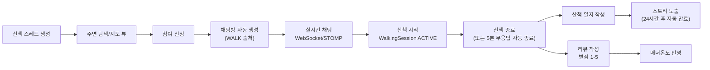
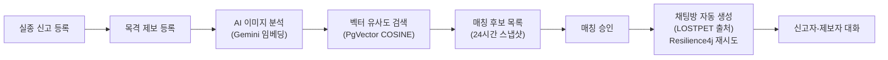
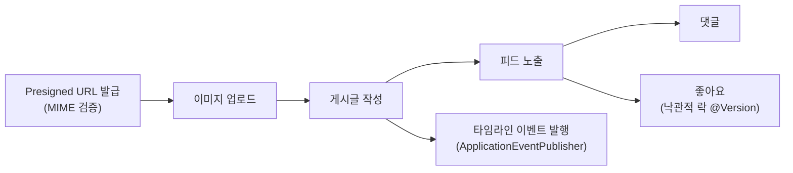
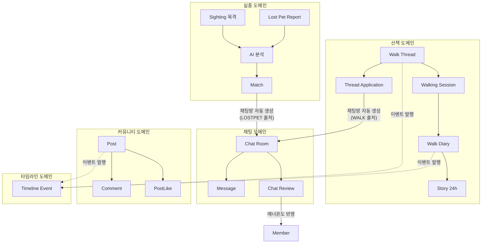

# 아이니이누 프로젝트 발표 자료

---

## 1페이지: 프로젝트 소개

- **아이니이누** - "산책의 진심을 잇다"
- 반려동물 산책 소셜 매칭 + 실종 동물 AI 검색 플랫폼
- 모노레포 3개 모듈: Backend (Spring Boot 3.5) / Frontend (Next.js 16) / common-docs

---

## 2페이지: 핵심 유저 플로우

### 메인 플로우 — 산책 매칭부터 리뷰까지



**상태 전이:**
- WalkThread: `RECRUITING` → `EXPIRED` (60분) / `COMPLETED` / `DELETED`
- WalkThreadApplication: `JOINED` ↔ `CANCELED`
- WalkingSession: `ACTIVE` → `ENDED` (수동 종료 또는 5분 heartbeat 타임아웃)

### 실종 동물 플로우 — AI 매칭부터 채팅 연결까지



**상태 전이:**
- LostPetReport: `ACTIVE` → `RESOLVED`
- LostPetSearchSession: `ACTIVE` → `EXPIRED` (24시간)
- LostPetMatch: `PENDING_APPROVAL` → `APPROVED` / `CHAT_LINKED` / `INVALIDATED` / `REJECTED`

### 커뮤니티 플로우



### 도메인 간 연결 구조



> 모든 도메인 간 연결은 **ID 참조**로만 이루어지며, 객체 직접 참조 없음 → 독립적 테스트·배포 가능

---

## 3페이지: 프로젝트 규모

| 항목 | 수치 |
|---|---|
| REST API 엔드포인트 | **88개**  |
| 테스트 메서드 | **544개** |
| 에러코드 | **79개**  |
| 도메인 (Bounded Context) | **9개** |

---

## 4페이지: 아키텍처 개요

- **DDD 기반 도메인 분리**: member, pet, walk, chat, community, lostpet, timeline + common
- 각 도메인별 독립적인 controller/service/repository/entity/dto/exception 패키지
- 도메인 간 참조는 **ID 참조만 허용** (객체 그래프 직접 참조 금지)

### 도메인별 DB 테이블 구성 (총 34개 테이블)

```mermaid
erDiagram
    %% ── member 도메인 (5) ──
    member {
        Long id PK
        String email "이메일"
        String nickname "닉네임"
        BigDecimal manner_temperature "매너온도"
    }
    refresh_token {
        Long id PK
        Long member_id FK "회원 참조 (ID)"
        String token "JWT 리프레시 토큰"
    }
    member_follow {
        Long id PK
        Long follower_id FK "팔로워"
        Long following_id FK "팔로잉"
    }
    member_personality {
        Long id PK
        Long member_id FK "회원 참조 (ID)"
        Long personality_type_id FK "성향 유형"
    }
    member_personality_type {
        Long id PK
        String name "성향 이름 (마스터)"
    }

    member ||--o{ refresh_token : "1:N"
    member ||--o{ member_follow : "팔로워"
    member ||--o{ member_personality : "1:N"
    member_personality_type ||--o{ member_personality : "1:N"

    %% ── pet 도메인 (5) ──
    pet {
        Long id PK
        Long member_id "회원 참조 (ID만)"
        String name "이름"
        Long breed_id FK "견종"
    }
    breed {
        Long id PK
        String name "견종명 (마스터)"
    }
    personality {
        Long id PK
        String name "성격 유형 (마스터)"
    }
    pet_personality {
        Long id PK
        Long pet_id FK
        Long personality_id FK
    }
    walking_style {
        Long id PK
        String name "산책 스타일 (마스터)"
    }
    pet_walking_style {
        Long id PK
        Long pet_id FK
        Long walking_style_id FK
    }

    breed ||--o{ pet : "1:N"
    pet ||--o{ pet_personality : "1:N"
    personality ||--o{ pet_personality : "1:N"
    pet ||--o{ pet_walking_style : "1:N"
    walking_style ||--o{ pet_walking_style : "1:N"

    %% ── walk 도메인 (8) ──
    thread {
        Long id PK
        Long member_id "작성자 (ID만)"
        String title "제목"
        Double latitude "위도"
        Double longitude "경도"
    }
    thread_filter {
        Long id PK
        Long thread_id FK "필터 조건"
    }
    thread_application {
        Long id PK
        Long thread_id FK
        Long member_id "신청자 (ID만)"
        String status "PENDING/ACCEPTED/REJECTED"
    }
    thread_application_pet {
        Long id PK
        Long application_id FK
        Long pet_id "반려견 (ID만)"
    }
    thread_pet {
        Long id PK
        Long thread_id FK
        Long pet_id "반려견 (ID만)"
    }
    walk_diary {
        Long id PK
        Long member_id "작성자 (ID만)"
        Long thread_id "산책 스레드 (ID만)"
        LocalDateTime deleted_at "소프트 딜리트"
    }
    walk_diary_photo_url {
        Long walk_diary_id FK
        String photo_url "사진 URL"
    }
    walking_session {
        Long id PK
        Long thread_id "스레드 (ID만)"
        String status "WALKING/COMPLETED"
    }

    thread ||--o{ thread_filter : "1:N"
    thread ||--o{ thread_application : "1:N"
    thread ||--o{ thread_pet : "1:N"
    thread_application ||--o{ thread_application_pet : "1:N"
    walk_diary ||--o{ walk_diary_photo_url : "ElementCollection"

    %% ── chat 도메인 (5) ──
    chat_room {
        Long id PK
        String type "DIRECT/GROUP"
        String origin "WALK/LOSTPET/MANUAL"
        String status "ACTIVE/CLOSED"
    }
    chat_participant {
        Long id PK
        Long room_id FK
        Long member_id "참여자 (ID만)"
    }
    chat_participant_pet {
        Long id PK
        Long participant_id FK
        Long pet_id "반려견 (ID만)"
    }
    message {
        Long id PK
        Long room_id FK
        Long sender_id "발신자 (ID만)"
        String content "메시지 내용"
    }
    chat_review {
        Long id PK
        Long room_id FK
        Long reviewer_id "리뷰어 (ID만)"
        Integer rating "별점 1-5"
    }

    chat_room ||--o{ chat_participant : "1:N"
    chat_room ||--o{ message : "1:N"
    chat_room ||--o{ chat_review : "1:N"
    chat_participant ||--o{ chat_participant_pet : "1:N"

    %% ── community 도메인 (4) ──
    post {
        Long id PK
        Long member_id "작성자 (ID만)"
        String content "내용"
        Integer like_count "좋아요 수"
    }
    post_image_url {
        Long post_id FK
        String image_url "이미지 URL"
    }
    comment {
        Long id PK
        Long post_id FK
        Long member_id "작성자 (ID만)"
    }
    post_like {
        Long id PK
        Long post_id FK
        Long member_id "좋아요 누른 회원 (ID만)"
    }

    post ||--o{ post_image_url : "ElementCollection"
    post ||--o{ comment : "1:N"
    post ||--o{ post_like : "1:N"

    %% ── lostpet 도메인 (5 + vector) ──
    lost_pet_report {
        Long id PK
        Long member_id "신고자 (ID만)"
        String status "ACTIVE/RESOLVED"
    }
    sighting {
        Long id PK
        Long member_id "제보자 (ID만)"
        Double latitude "목격 위도"
        Double longitude "목격 경도"
    }
    lost_pet_match {
        Long id PK
        Long report_id FK
        Long sighting_id FK
        String status "PENDING/APPROVED/REJECTED"
    }
    lost_pet_search_session {
        Long id PK
        Long member_id "검색자 (ID만)"
        Long report_id FK
    }
    lost_pet_search_candidate {
        Long id PK
        Long session_id FK
        Long sighting_id FK
    }

    lost_pet_report ||--o{ lost_pet_match : "1:N"
    sighting ||--o{ lost_pet_match : "1:N"
    lost_pet_report ||--o{ lost_pet_search_session : "1:N"
    lost_pet_search_session ||--o{ lost_pet_search_candidate : "1:N"

    %% ── timeline 도메인 (1) ──
    timeline_event {
        Long id PK
        String event_type "이벤트 유형"
        Long reference_id "참조 대상 (ID만)"
        Boolean deleted "소프트 딜리트"
    }
```



### 왜 이렇게 구성했는가?

- **"실제 서비스라면?"을 기준으로 설계** — 학습용 CRUD가 아니라, 실제 다중 사용자 환경에서 발생하는 문제를 미리 고려
- **도메인 간 FK 대신 ID 참조**: `pet` 테이블이 `member_id`를 Long으로만 갖고, `@ManyToOne(Member)`를 쓰지 않음 → 도메인 간 결합도를 낮추고, 독립적인 배포·테스트가 가능한 구조
---

## 5페이지: Schema-Driven Development (SDD)

- **OpenAPI 스펙이 Single Source of Truth**
- **Contract Test 12개**: OpenAPI 스펙과 실제 구현이 일치하는지 자동 검증
  - 요청 스키마 검증, 응답 상태 검증, 에러 매트릭스 동기화, 페이지네이션/정렬 규격 검증
- PRD → OpenAPI → Backend → Frontend 순으로 우선순위 정의

---

## 6페이지: API 문서화 — Swagger UI를 "살아있는 계약서"로

### 문서화 규모

| 항목 | 수치 |
|---|---|
| `@Operation` (summary + description) | **87개** — 전 엔드포인트 빠짐없이 |
| `@Schema` (DTO 필드 설명 + 예시) | **454개** — 78개 DTO 파일 |

### 모든 필드에 한국어 설명 + 예시값

```java
// DTO 필드마다 설명·예시·제약조건을 명시
@Schema(description = "회원 닉네임입니다.", example = "몽이아빠",
        requiredMode = Schema.RequiredMode.REQUIRED)
private String nickname;

@Schema(description = "성별 코드입니다.", example = "MALE",
        allowableValues = {"MALE", "FEMALE"})
private String gender;
```

### 컨트롤러 레벨 문서화

```java
@Operation(summary = "이메일 로그인",
           description = "이메일/비밀번호로 로그인하고 Access/Refresh Token을 발급합니다.")
@ApiResponses({
    @ApiResponse(responseCode = "200", description = "로그인 성공"),
    @ApiResponse(responseCode = "400", description = "요청 검증 실패"),
    @ApiResponse(responseCode = "401", description = "인증 실패")
})
```

---

## 7페이지: AI 기반 실종 동물 매칭

- **Spring AI + Google Gemini** (`text-embedding-004`) 임베딩 생성
- **PgVector** (PostgreSQL 확장) 벡터 저장소 — 768차원, COSINE_DISTANCE, HNSW 인덱스
- 실종 신고 → AI 분석 → 목격 정보와 벡터 유사도 검색으로 자동 매칭
- `ObjectProvider<VectorStore>`로 AI 서비스 미사용 시 graceful degradation

---

## 8페이지: Claude Code 활용 - "팀원의 AI"까지 컨텍스트를 공유하는 개발 환경

### 핵심 철학

> AI를 활용하는 팀에서는 **사람 간의 소통**뿐 아니라 **각 팀원이 사용하는 AI도 동일한 컨텍스트를 갖춰야** 일관된 코드가 나온다.

### 컨텍스트 공유 체계

- **CLAUDE.md** (프로젝트 루트에 커밋)
  - 누구의 Claude Code든 세션 시작 시 자동으로 읽는 파일
  - 프로젝트 구조, 빌드 명령어, 아키텍처, 테스트 전략, 소스 오브 트루스 우선순위 등 상세 기술
  - → 어떤 팀원의 AI가 코드를 생성하든 **같은 컨벤션, 같은 패턴**을 따르게 됨
- **커스텀 스킬 (`.claude/skills/`)** — 역시 Git에 커밋
  - `spring-backend-generator`: conventions.md, entity-patterns.md 등 레퍼런스를 내장
  - `spring-test-generator`: unit/integration/slice 패턴 문서를 내장
  - → 팀원 A의 AI가 만든 코드와 팀원 B의 AI가 만든 코드가 **같은 구조**
- **common-docs/ (PRD + OpenAPI 스펙)** — Single Source of Truth
  - AI가 코드를 생성할 때 참조하는 기능 요구사항과 API 계약
  - 사람이 구두로 전달하지 않아도 AI가 직접 읽고 준수

---

## 9페이지: 프론트엔드 아키텍처

- **Next.js 16 + React 19 + TypeScript 5.9 + Tailwind CSS 4**
- **Zustand** 4개 스토어로 상태 관리 (Auth, User, Chat, Config)
- **MSW (Mock Service Worker)**: 백엔드 없이 개발 가능한 목업 환경
- **apiClient.ts**: `ApiResponse<T>` 봉투 자동 언래핑, 인증 헤더 자동 주입
- Leaflet 지도 (산책 근처 레이더), STOMP.js (실시간 채팅), Daum 주소 검색 연동

---

## 10페이지: 우리가 중요하게 생각한 것 (마무리)

- **"실제 서비스 운영 품질"에 집중**
- 544개 테스트로 모든 비즈니스 로직 검증
- 79개 에러코드로 모든 예외 케이스 정의
- Contract Test로 API 스펙과 구현의 자동 동기화 보장
- SDD 기반 개발로 프론트-백 간 계약 불일치 방지
- Claude Code 커스텀 스킬로 팀 컨벤션 자동 준수
