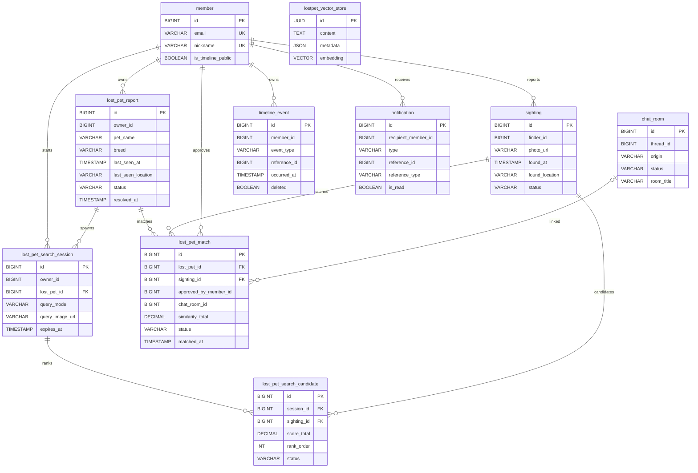

# AINI INU 데이터베이스 설계도

기준 일자: 2026-03-12

기준 소스:
- `aini-inu-backend/src/main/java/scit/ainiinu/**/entity/*.java`
- `aini-inu-backend/src/main/java/scit/ainiinu/lostpet/domain/*.java`
- `aini-inu-backend/src/main/resources/db/ddl/*.sql`
- `aini-inu-backend/src/main/resources/db/seed/00_lookup_seed.sql`

공통 규칙:
- `BaseTimeEntity` 상속 테이블은 공통으로 `created_at`, `updated_at` 컬럼을 가진다.
- Mermaid 관계선은 구현 기준상의 관계를 나타낸다. 다만 일부 도메인은 실제 DB FK 대신 ID 참조만 저장한다.
- `story`는 별도 테이블이 아니라 `walk_diary + member_follow` 기반 조회 조합이며, 레거시 `story` 테이블은 제거되었다.

## 1. Core Domain ERD

```mermaid
erDiagram
    member {
        BIGINT id PK
        VARCHAR email UK
        VARCHAR nickname UK
        VARCHAR member_type
        VARCHAR status
        VARCHAR gender
        BOOLEAN is_verified
        BOOLEAN is_timeline_public
        INT manner_score_sum
        INT manner_score_count
    }

    refresh_token {
        BIGINT id PK
        BIGINT member_id FK
        VARCHAR token_hash UK
        TIMESTAMP expires_at
        TIMESTAMP revoked_at
    }

    member_follow {
        BIGINT id PK
        BIGINT follower_id
        BIGINT following_id
    }

    member_personality_type {
        BIGINT id PK
        VARCHAR name
        VARCHAR code UK
    }

    member_personality {
        BIGINT id PK
        BIGINT member_id FK
        BIGINT personality_type_id FK
    }

    breed {
        BIGINT id PK
        VARCHAR name
        VARCHAR size
    }

    pet {
        BIGINT id PK
        BIGINT member_id
        BIGINT breed_id FK
        VARCHAR name
        INT age
        VARCHAR gender
        VARCHAR size
        BOOLEAN is_neutered
        BOOLEAN is_main
    }

    personality {
        BIGINT id PK
        VARCHAR name
        VARCHAR code UK
    }

    pet_personality {
        BIGINT id PK
        BIGINT pet_id FK
        BIGINT personality_id FK
    }

    walking_style {
        BIGINT id PK
        VARCHAR name
        VARCHAR code UK
    }

    pet_walking_style {
        BIGINT id PK
        BIGINT pet_id FK
        BIGINT walking_style_id FK
    }

    thread {
        BIGINT id PK
        BIGINT author_id
        VARCHAR title
        TIMESTAMP start_time
        DATE walk_date
        VARCHAR chat_type
        INT max_participants
        VARCHAR status
        BIGINT version
    }

    thread_pet {
        BIGINT id PK
        BIGINT thread_id
        BIGINT pet_id
    }

    thread_filter {
        BIGINT id PK
        BIGINT thread_id
        VARCHAR type
        VARCHAR values_json
        BOOLEAN is_required
    }

    thread_application {
        BIGINT id PK
        BIGINT thread_id
        BIGINT member_id
        BIGINT chat_room_id
        VARCHAR status
        BIGINT version
    }

    thread_application_pet {
        BIGINT id PK
        BIGINT application_id
        BIGINT pet_id
    }

    walk_diary {
        BIGINT id PK
        BIGINT member_id
        BIGINT thread_id
        VARCHAR title
        DATE walk_date
        BOOLEAN is_public
        TIMESTAMP deleted_at
        BIGINT version
    }

    walk_diary_photo_url {
        BIGINT walk_diary_id FK
        INT display_order
        VARCHAR photo_url
    }

    walking_session {
        BIGINT id PK
        BIGINT member_id
        VARCHAR status
        TIMESTAMP started_at
        TIMESTAMP ended_at
        TIMESTAMP last_heartbeat_at
    }

    chat_room {
        BIGINT id PK
        BIGINT thread_id
        VARCHAR chat_type
        VARCHAR origin
        VARCHAR status
        VARCHAR room_title
        BOOLEAN walk_confirmed
        TIMESTAMP last_message_at
        BIGINT version
    }

    chat_participant {
        BIGINT id PK
        BIGINT chat_room_id
        BIGINT member_id
        BIGINT last_read_message_id
        VARCHAR walk_confirm_state
        TIMESTAMP joined_at
        TIMESTAMP left_at
    }

    chat_participant_pet {
        BIGINT id PK
        BIGINT chat_participant_id
        BIGINT pet_id
    }

    message {
        BIGINT id PK
        BIGINT chat_room_id
        BIGINT sender_id
        VARCHAR message_type
        VARCHAR client_message_id
        TIMESTAMP sent_at
    }

    chat_review {
        BIGINT id PK
        BIGINT chat_room_id
        BIGINT reviewer_id
        BIGINT reviewee_id
        INT score
    }

    post {
        BIGINT id PK
        BIGINT author_id
        VARCHAR content
        INT like_count
        INT comment_count
        BIGINT version
    }

    post_image_url {
        BIGINT post_id FK
        VARCHAR image_url
    }

    comment {
        BIGINT id PK
        BIGINT post_id
        BIGINT author_id
        VARCHAR content
    }

    post_like {
        BIGINT id PK
        BIGINT post_id
        BIGINT member_id
    }

    member ||--o{ refresh_token : owns
    member ||--o{ member_personality : selects
    member_personality_type ||--o{ member_personality : classifies
    member ||--o{ member_follow : follower
    member ||--o{ member_follow : following

    member ||--o{ pet : owns
    breed ||--o{ pet : classifies
    pet ||--o{ pet_personality : has
    personality ||--o{ pet_personality : maps
    pet ||--o{ pet_walking_style : has
    walking_style ||--o{ pet_walking_style : maps

    member ||--o{ thread : authors
    thread ||--o{ thread_pet : includes
    pet ||--o{ thread_pet : joins
    thread ||--o{ thread_filter : filters
    thread ||--o{ thread_application : receives
    member ||--o{ thread_application : applies
    thread_application ||--o{ thread_application_pet : includes
    pet ||--o{ thread_application_pet : accompanies

    member ||--o{ walk_diary : writes
    thread ||--o{ walk_diary : references
    walk_diary ||--o{ walk_diary_photo_url : stores
    member ||--o{ walking_session : tracks

    thread ||--o{ chat_room : opens
    chat_room ||--o{ thread_application : reuses
    chat_room ||--o{ chat_participant : has
    member ||--o{ chat_participant : joins
    chat_participant ||--o{ chat_participant_pet : maps
    pet ||--o{ chat_participant_pet : links
    chat_room ||--o{ message : contains
    member ||--o{ message : sends
    chat_room ||--o{ chat_review : collects
    member ||--o{ chat_review : reviewer
    member ||--o{ chat_review : reviewee

    member ||--o{ post : authors
    post ||--o{ post_image_url : stores
    post ||--o{ comment : has
    member ||--o{ comment : writes
    post ||--o{ post_like : receives
    member ||--o{ post_like : creates
```

## 2. Safety / Cross-Cutting ERD

## 3. 설계 메모

### 3.1 물리 FK 유지 테이블
- `refresh_token.member_id -> member.id`
- `member_personality.member_id -> member.id`
- `member_personality.personality_type_id -> member_personality_type.id`
- `pet.breed_id -> breed.id`
- `pet_personality.pet_id -> pet.id`
- `pet_personality.personality_id -> personality.id`
- `pet_walking_style.pet_id -> pet.id`
- `pet_walking_style.walking_style_id -> walking_style.id`
- `lost_pet_search_session.lost_pet_id -> lost_pet_report.id`
- `lost_pet_search_candidate.session_id -> lost_pet_search_session.id`
- `lost_pet_search_candidate.sighting_id -> sighting.id`
- `lost_pet_match.lost_pet_id -> lost_pet_report.id`
- `lost_pet_match.sighting_id -> sighting.id`

### 3.2 ID 참조 위주 설계
- `pet.member_id`, `member_follow.*`, `thread*`, `walk_diary.member_id`, `walking_session.member_id`는 대부분 FK 없이 논리 참조로만 연결된다.
- `chat_room`, `chat_participant`, `message`, `chat_review` 역시 scalar FK 컬럼 위주이며 DB 레벨 제약보다 애플리케이션 로직에 더 의존한다.
- `comment`와 `post_like`는 원래 FK가 생성될 수 있었지만 `07_community_fk_removal.sql`에서 FK를 제거했다.
- `notification`과 `timeline_event`는 다형 참조 구조라 `reference_id`, `reference_type` 또는 `event_type`으로 대상을 식별한다.

### 3.3 주요 유니크 / 인덱스 포인트
- `member`: `email`, `nickname` 유니크
- `member_follow`: `(follower_id, following_id)` 유니크
- `member_personality`: `(member_id, personality_type_id)` 유니크
- `refresh_token`: `token_hash` 유니크
- `thread`: `(status, start_time)` 인덱스
- `thread_application`: `(thread_id, member_id)` 유니크
- `thread_application_pet`: `(application_id, pet_id)` 유니크 + `application_id` 인덱스
- `thread_pet`: `(thread_id, pet_id)` 유니크
- `walk_diary`: `(member_id, created_at, id)` 인덱스
- `walking_session`: 활성 세션 대상 partial unique index
- `chat_participant`: `(chat_room_id, member_id)` 유니크
- `chat_participant_pet`: `(chat_participant_id, pet_id)` 유니크
- `message`: `(chat_room_id, sender_id, client_message_id)` 유니크 + `(chat_room_id, id)` 인덱스
- `chat_review`: `(chat_room_id, reviewer_id, reviewee_id)` 유니크
- `post_like`: `(post_id, member_id)` 유니크
- `post`: `(created_at, id)`, `(author_id, created_at)` 인덱스
- `comment`: `(post_id, created_at)` 인덱스
- `lost_pet_search_candidate`: `(session_id, sighting_id)`, `(session_id, rank_order)` 유니크
- `lost_pet_match`: `(lost_pet_id, sighting_id)` 유니크
- `timeline_event`: `(event_type, reference_id)` 유니크
- `notification`: 수신자 최신순 조회 인덱스 + unread partial index

### 3.4 제거 / 파생 객체
- `story` 테이블은 `06_legacy_story_cleanup.sql`에서 제거됐다.
- `block` 테이블은 `05_member_block_feature_removal.sql`에서 제거됐다.
- `pet.is_certified`, `pet.certification_number` 컬럼은 `13_pet_certification_removal.sql`에서 제거됐다.
- `lostpet_vector_store`는 Spring AI `pgvector` 검색용 보조 테이블이며, 업무 엔티티와 직접 FK로 묶이지 않는다.

### 3.5 해석 시 주의점
- `member.personality` 문자열 프로필 컬럼과 `member_personality` 선택형 조인 테이블은 별도 목적이다.
- `Location`은 별도 테이블이 아니라 엔티티 내부 컬럼(`place_name`, `latitude`, `longitude`, `address`)으로 펼쳐진다.
- `chat_participant_pet`, `pet_personality`, `pet_walking_style`, `post_image_url`, `walk_diary_photo_url`는 공통 감사 컬럼이 없는 보조 테이블이다.
